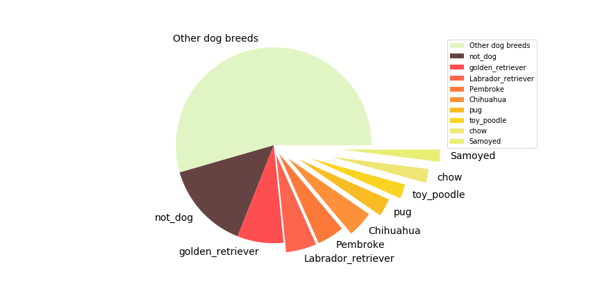

```{r setup, include=FALSE, echo=FALSE, warning=FALSE}
knitr::opts_chunk$set(echo = TRUE)
setwd('/Users/Rebecca/Documents/Study/Udacity_DAND/projects/project_3/tweet_data_wrangling')
library(ggplot2)
library(gridExtra)
library(dplyr)
library(reshape2)
library(GGally)
library(RColorBrewer)
```

Dogs are one of the most popular pets which increase our mood dramatically everyday. People always would like to share pictures of their pets with their friends or even on the Internet. Here we would like to analyze an amazing Twitter account @dog_rates also known as WeRateDogs which rates dogs and gives humorous comments based on dogs' pictures. Various data visualizations are provided below to help you understand this Twitter account and its audience's opinions better. 

```{r echo=FALSE, warning=FALSE}
tweet_df <- read.csv('twitter_archive_master.csv')
dog_df <- read.csv('dog_inforamtion_master.csv')
```

```{r echo=FALSE, warning=FALSE}
# select favorite_count and retweet_count and transform 'timestamp' to datetime type 
audience_size = tweet_df[c('timestamp', 'favorite_count', 'retweet_count')]
audience_size$timestamp = as.Date(strptime(as.character(audience_size$timestamp), format = '%Y-%m-%d %H:%M:%S'))
audience_size_long = melt(audience_size, id = 'timestamp')
popular_dog = merge(tweet_df[c('tweet_id', 'favorite_count', 'retweet_count')], dog_df[c('tweet_id', 'top_breed')], by = 'tweet_id')
popular_dog$top_breed = factor(popular_dog$top_breed, levels = c("Other dog breeds", "not_dog", "golden_retriever", "Labrador_retriever", "Pembroke", "Chihuahua", "pug", "toy_poodle" , 'chow', "Samoyed"))
```

## How popular is @dog_rates?

### Overview of audience size

First of all, let's have a glance at the audience size of @dog_rates using histogram with log scale. Here we use favorite counts and retweet counts as a measurement of audience size.

```{r echo=FALSE, warning=FALSE, fig.width=16, fig.height=4}
p1 <- ggplot(aes(x = favorite_count), data = audience_size) +
  geom_histogram(fill = '#FF847C', color = '#a02219', binwidth = 0.1) +
  scale_x_log10(breaks = c(100,1000,10000,100000)) +
  ggtitle('Favorite counts distribution in log scale')
p2 <- ggplot(aes(x = retweet_count), data = tweet_df) +
  geom_histogram(fill = '#586063', color = '#2A363B', binwidth = 0.1) +
  scale_x_log10(breaks = c(100,1000,10000,100000)) +
  ggtitle('Retweet counts distribution in log scale') 
grid.arrange(p1, p2, ncol = 2)
```

As you can see from above, the majority of favorite counts and retweet counts are both between 1000 to 10000, which means the audience size of this @dog_rates is over thousands. The most popular tweets from @dog_rates even have favorites and retweets over 10,0000 level. Hence, @dog_rates has a large audience size.

Next, we will use box plot to have a better understanding of descriptive statistics of these two counts. Since the data is higly skewed, we only display counts less than 10000 for better visualization.

```{r echo=FALSE, warning=FALSE, fig.width=16, fig.height=4}
cleaned_audience_size_long = subset(audience_size_long, audience_size_long$value < 10000)
ggplot(aes(x = variable, y = value, fill = variable, color = variable), data = cleaned_audience_size_long) +
  geom_boxplot() +
  scale_fill_manual(values = c('#FF847C', '#586063')) +
  scale_color_manual(values = c('#a02219', '#2A363B'))+
  xlab('') +
  ylab('counts')

```

```{r echo=FALSE, warning=FALSE}
summary(audience_size)
```

From the descriptive statistics shown above, we can see that median of favorite counts and retweet counts are 3548 and 1422 seperately which comfirmed that in common cases the number of people who like tweets from @dog_rates is at thousand level magnitude.

### Change of audience size over time 

We may also be curious about the how its audience size changes over time. To explore the changes in its audience size, we would plot the favorite counts and retweet counts over time.

```{r echo=FALSE, warning=FALSE, fig.width=16, fig.height=4}
p1 <- ggplot(aes(x = timestamp, y = value, color = variable), data = audience_size_long) +
  geom_line() +
  scale_color_manual(values = c('#FF847C', '#586063')) +
  scale_x_date(date_breaks = '2 month', date_labels = '%Y-%m') + 
  ggtitle('Favorite and retweet counts over time') +
  xlab('') +
  ylab('counts')
p2 <- ggplot(aes(x = timestamp, y = value, color = variable), data = audience_size_long) +
  geom_smooth(method = 'loess') +
  scale_color_manual(values = c('#FF847C', '#586063')) +
  scale_x_date(date_breaks = '2 month', date_labels = '%Y-%m') + 
  ggtitle('Smoothen favorite and retweet counts by LOESS') +
  xlab('') +
  ylab('counts')
grid.arrange(p1, p2, ncol = 2)
```

From the left figure above, we observed an noticable increasing trend on favorite counts and an almost invisible increasing trend on retweet counts. However, if you check the figure on the right hand side in which we smoothened the lines by LOESS method, you can easily draw a conclusion that both counts increases over time form 2015 to 2017. In additiont the increasing rate of favorite count augmented slightly after 2017.

You may also noticed that during 2016-04 to 2016-06 the quality of tweets from @dog_rates was not good enough to amuse its audience, because the favorite counts and retweet counts were relatively low during that period of time.

## How does @dog_rates rate dogs?

By viewing the original tweets from '@dog_rates', we can find that its tweets are always full of humor. In some cases the author may not rate dogs in a reasonable way just for adding jokes. In other cases, when the figures do not illustrate dogs, the scores can be low. To be fair, we will split the whole tweets samples into two groups to see how the author judge the figures. One group for real dog breeds and the other for others which are not dogs. The splitting criterion is based on the breed prediciton obtained by neural network.

```{r echo=FALSE, warning=FALSE}
ggplot(aes(x = rating_value, fill = isDog), data = dog_df) +
    geom_density(alpha = 0.5, color = 'black') +
    xlim(0,2) + 
    scale_fill_manual(values = c('#664343','#FC913A')) +
    ggtitle('Rating score in tweets') +
    xlab('rating score')
```

In the density plot above, we noticed that in general @dog_rates rated real dogs with higher scores than other animals/objects shown in the tweet figures. The reason is that the majority of real dogs have rating score higher than 1, but quite a proportion in the 'Others' group were rated below 1. However, the peaks of these two groups are both larger than 1.0, which means the author was very tolerant when rating whatever he got in the figures.

## What is the most popular breed?

### Opinions of @dog_rates
An intuitive way to explore the most popular breeds shown in tweets from @dog_rates is to use a pie chart to display the proportion of breeds as follow:



The above pie chart illustrates the top 10 breeds shown in @dog_rates including 'not dog' breed.

### Opinions of the audience

It would be a little biased if we just consider the frequency of dogs shown in tweets when selecting the most popular dog breed. The thoughts of audience also matters.

```{r echo=FALSE, warning=FALSE, fig.width=12, fig.height=12}
p1 <- ggplot(aes(x = top_breed, y = favorite_count, fill = top_breed), data = popular_dog) +
  geom_boxplot() +
  stat_summary(geom = 'point', shape = 4, fun.y = mean) + 
  scale_fill_manual(values = c('#E1F5C4', '#664343', '#FF4E50', '#ff654e', '#fc7a39', '#FC913A', '#f9bc22', '#f9d423',
          '#EDE574', '#e8ed74')) +
  xlab('')
p2 <- ggplot(aes(x = top_breed, y = retweet_count, fill = top_breed), data = popular_dog) +
  geom_boxplot() +
  stat_summary(geom = 'point', shape = 4, fun.y = mean) +
  scale_fill_manual(values = c('#E1F5C4', '#664343', '#FF4E50', '#ff654e', '#fc7a39', '#FC913A', '#f9bc22', '#f9d423',
          '#EDE574', '#e8ed74')) +
  xlab('')
grid.arrange(p1, p2, ncol = 1)
```

```{r echo=FALSE, warning=FALSE}
mean_popular_dog <- popular_dog %>%
  group_by(top_breed) %>%
  summarise(favorite_mean = mean(favorite_count), retweet_mean = mean(retweet_count)) %>%
  arrange(top_breed)
mean_popular_dog
```

The box plots and statistics above implies how audience likes each dog breed. People's opinions above golden retriever, Labrador retriever, Pembroke Welsh corgi and Samoyed is more various than other dog breeds. In the meanwhile, these four breeds turns out to be the top 4 popular dog breeds if you measure them in mean favorite counts and mean retweet counts. The rank for the top 4 popular breeds judged by audience is shown as follow:

* Top 1: Samoyed
* Top 2: golden retriever
* Top 3: Labrador retriever
* Top 4: Pembroke Welsh corgi

One glaring change in the popularity rank is that Samoyed was in 10-th popular breed in the pie chart including two fake breeds, 'not_dog' and 'other dog breeds', but Samoyed is actually the favorite dog breed in audience opinion based on the measurement above. 